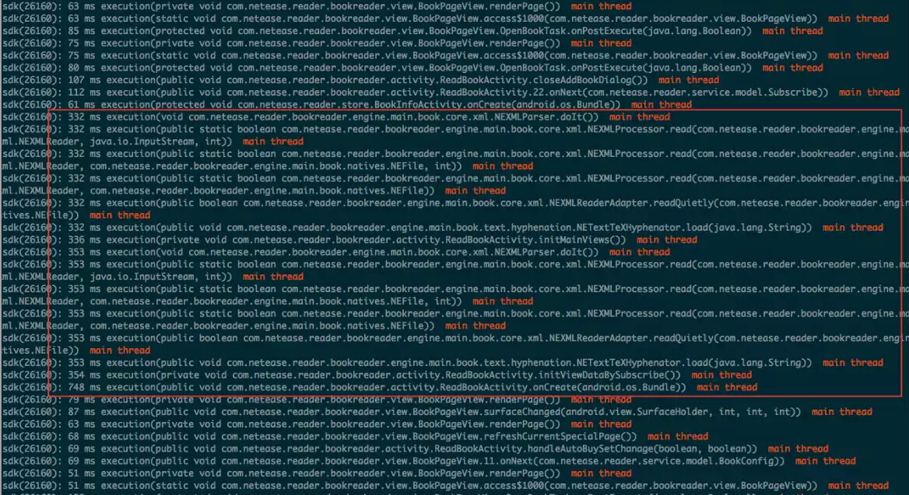

### AOP概念
百度百科中对AOP的解释如下:
在软件业，AOP为Aspect Oriented Programming的缩写，意为：面向切面编程，通过预编译方式和运行期动态代理实现程序功能的统一维护的一种技术。AOP是OOP的延续，是软件开发中的一个热点，也是Spring框架中的一个重要内容，是函数式编程的一种衍生范型。利用AOP可以对业务逻辑的各个部分进行隔离，从而使得业务逻辑各部分之间的耦合度降低，提高程序的可重用性，同时提高了开发的效率。
说白了，AOP其实就是OOP的补充，OOP从横向上区分出一个个的类来，而AOP则从纵向上向对象中加入特定的代码。
### AOP在网易新闻android客户端的应用
看过之前文章的同学，可能了解，网易新闻android客户端的热更新技术使用的AOP的技术。除此之外AOP还有哪些能够解决我们痛点的使用场景的。我简单列举一下目前我们再android客户端上对AOP技术的应用
#### 网易新闻热补丁技术
网易新闻的android客户端热更新技术使用的是AspectJ， AspectJ就是AOP技术的一种框架。详情[网易新闻热补丁技术实践](http://glanwang.com/2017/07/14/Android/%E7%BD%91%E6%98%93%E6%96%B0%E9%97%BB%E7%83%AD%E8%A1%A5%E4%B8%81%E6%8A%80%E6%9C%AF%E5%AE%9E%E8%B7%B5/)
#### 检测方法耗时
新闻客户端开发了一套能够根据指定的sdk进行排查方法耗时的工具，原理就是使用的AspectJ处理字节码包装方法。
方法耗时，这个其实android上已经有一些现成的工具，比如trace view等等，这些工具都可以进行方法耗时的检测。但是痛点是这些工具使用起来都比较麻烦，效率低下， 而且无法针对某一个块代码或者某个指定的sdk进行查看方法耗时。
我们为了能够提高客户端的FPS，其中有一个思路就是希望降低主线程方法耗时。 最初的思路就是使用trace View等工具进行排查。不用不知道一用你就会发现有多么的繁琐。于是我们希望能有一种方式能够快速打印出我们的方法耗时。
于是我们采用了AOP的技术，对每个方法做一个切点，在执行之后打印方法耗时。
具体的实现原理和网易新闻热更新技术原理差不多，都是对方法做切点，注入一段自己逻辑，只不过注入的是计算方法耗时的逻辑而已。
具体实现仍然使用的是AspectJ的方案:
I 编译完成之后使用AspectJ编译器处理字节码， 两种方案
#### a. hook java compiler的方案
直接hook java Compiler的Task，在java源码编译完成之后执行AspectJ的编译器，进行字节码插桩操作。
```
project.android.applicationVariants.all { variant ->
            if (variant.buildType.name != "release") {
                log.debug("Skipping non-release build type '${variant.buildType.name}'.")
                return;
            }
            JavaCompile javaCompile = variant.javaCompile
            javaCompile.doLast {
                            String[] args = ["-showWeaveInfo",
                                             "-1.5",
                                             "-inpath", javaCompile.destinationDir.toString(),
                                             "-aspectpath", javaCompile.classpath.asPath,
                                             "-d", javaCompile.destinationDir.toString(),
                                             "-classpath", javaCompile.classpath.asPath,
                                             "-bootclasspath", project.android.bootClasspath.join(File.pathSeparator)]
                            log.debug "ajc args: " + Arrays.toString(args)
                            MessageHandler handler = new MessageHandler(true);
                            new Main().run(args, handler);                    
                    }
                }
            }
        }
```
此中方案的缺陷就是对参与编译过程的代码处理很简单，但是对于一些不参与编译过程的jar/aar等处理比较困难。
#### b. gradle Transform API方案
对于上述方法存在一些问题，对于一些jar包，其实已经是字节码了不会走这个过程，因此对一些jar的插桩操作不是很好处理。因此我们采用了Transform API的方案。 transform api是Android gradle plugin 1.5之后新api， 作用就是在生成dex之前，给开发者一个机会能够统一进行修改字节码， 这个过程中你能拿到所有的源码生成的class文件和jar/aar中的class文件。因此，此时处理能够满足我们对所有的class文件进行处理。 为了方便我们实现了一个gradle plugin 专门进行AspectJ处理class文件，完成字节码插桩操作。
    并且为了处理对第三方jar包的方法耗时最终，我们可以配置对指定的jar或者aar进行字节码插桩，查看方法耗时.
    如: 插件的配置如下，再buildType为debug的时，对AMap_Location jar包(高德地图sdk)进行字节码插桩
    ```
    aspectj {
        includeJarFilter 'AMap_Location'
        enableBuildType 'debug'//, 'debug' //buildType为debug时，会输出主线程方法耗时时间， 需要关闭instantRun，clean再run
        enable true
        printlog true
    }
    ```

II 注入计算方法耗时的逻辑
```
@Aspect
public class AspectJSpectControler {
    @Around(value = "execution(* com.netease.newsreader..*.*(..)")
    public Object weavePatchLogic(ProceedingJoinPoint joinPoint) throws Throwable {
        if (BuildConfig.DEBUG) { //debug    状态下计算方法耗时
            long startT = System.currentTimeMillis();
            Object proceed = joinPoint.proceed();
            long consume = System.currentTimeMillis() - startT;
            if (consume > 40 && Thread.currentThread().getId() == BaseApplication.getInstance().getMainThreadId()) { // 方法耗时大于40毫秒，并且当前线程是主线程，则直接打印当前方法的签名
                NeteaseLog.d(METHOD_TIME_TAG, consume + " ms " + joinPoint.getSignature() + " main thread method");
            }
            return proceed;
        }
        return joinPoint.proceed();
    }    
}    
```
II 运行app，过滤log查看方法耗时
打印log过滤关键字
`adb logcat | grep method`

#### 对第三方sdk或开源哭某些方法进行hook修改
原理同上
#### 处理权限问题
处理权限问题，目前我们没有使用AspectJ的方案。大家如果感兴趣的话，可以从github查一下，很多公司确实是使用了这种方案。
