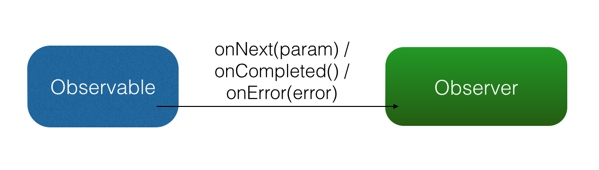
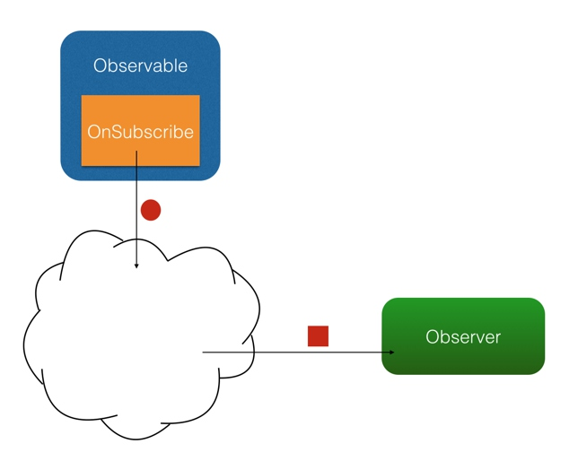
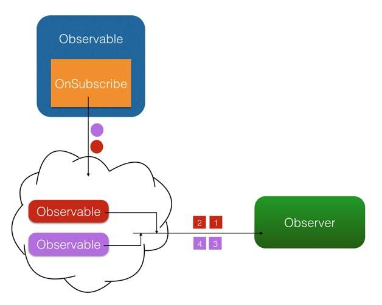
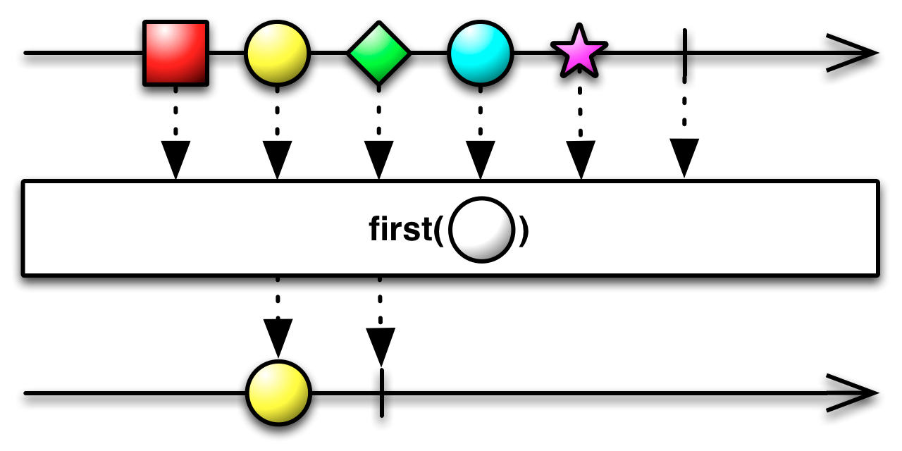
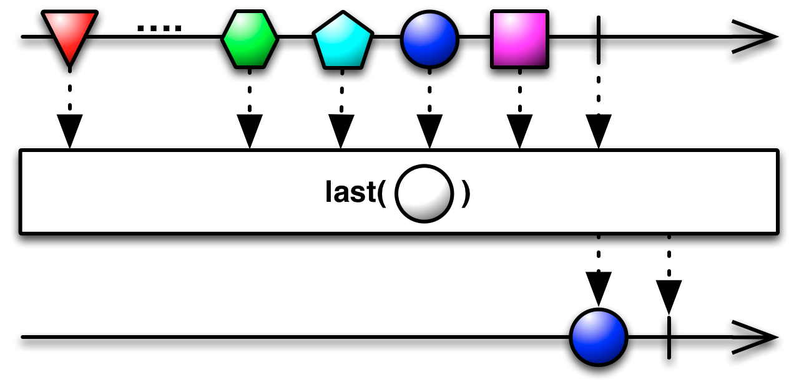

参考大神`抛物线`的文章 [给Android开发这的RxJava详解](http://gank.io/post/560e15be2dca930e00da1083)
# 1. 实现原理
扩展的观察者模式。观察者模式的原理不在多说，不懂的(有个网站名字叫百度/Google)。
使用RxJava要弄清楚几个单词的具体含义：
`Observable`:被观察者、事件源
`Observer`:订阅者、观察者（RxJava中可以理解为和Subscriber相同）
`Subscriber`:订阅者，观察者(同Observer)
`subscribe` 订阅
`Observable 和 Observer 通过 subscribe() 方法实现订阅关系，从而 Observable 可以在需要的时候发出事件来通知 Observer。`
与传统观察者模式不同， RxJava 的事件回调方法除了普通事件 onNext() （相当于 onClick() / onEvent()）之外，还定义了两个特殊的事件：onCompleted() 和 onError()。

- onCompleted(): 事件队列完结。RxJava 不仅把每个事件单独处理，还会把它们看做一个队列。RxJava 规定，当不会再有新的 onNext() 发出时，需要触发 onCompleted() 方法作为标志。
- onError(): 事件队列异常。在事件处理过程中出异常时，onError() 会被触发，同时队列自动终止，不允许再有事件发出。
- 在一个正确运行的事件序列中, onCompleted() 和 onError() 有且只有一个，并且是事件序列中的最后一个。需要注意的是，onCompleted() 和 onError() 二者也是互斥的，即在队列中调用了其中一个，就不应该再调用另一个。

普通的观察者模式  
RxJava观察者模式
#2 如何使用
###  1）创建Obser/Subscriber
Observer 即观察者，它决定事件触发的时候将有怎样的行为。 
RxJava中`Observer`是一个接口，`Subscriber`是实现了Obser的一个抽象类，并增加了`onStart()`, `unsubscribe()`等方法。
```java
Observer<String> observer = new Observer<String>() {
    @Override
    public void onNext(String s) {
        Log.d(tag, "Item: " + s);
    }

    @Override
    public void onCompleted() {
        Log.d(tag, "Completed!");
    }

    @Override
    public void onError(Throwable e) {
        Log.d(tag, "Error!");
    }
};
```
```java
Subscriber<String> subscriber = new Subscriber<String>() {
    @Override
    public void onNext(String s) {
        Log.d(tag, "Item: " + s);
    }

    @Override
    public void onCompleted() {
        Log.d(tag, "Completed!");
    }

    @Override
    public void onError(Throwable e) {
        Log.d(tag, "Error!");
    }
};
```
- `onStart()`:从字面都可以明白是什么意思
- `unsubscribe()`: 这是 Subscriber 所实现的另一个接口 Subscription 的方法，用于取消订阅。在这个方法被调用后，Subscriber 将不再接收事件。一般在这个方法调用前，可以使用 isUnsubscribed() 先判断一下状态。 unsubscribe() 这个方法很重要，因为在 subscribe() 之后， Observable 会持有 Subscriber 的引用，这个引用如果不能及时被释放，将有内存泄露的风险。所以最好保持一个原则：要在不再使用的时候尽快在合适的地方（例如 onPause() onStop() 等方法中）调用 unsubscribe() 来解除引用关系，以避免内存泄露的发生。

###  2）创建 Observable
Observable 即被观察者，它决定什么时候触发事件以及触发怎样的事件。
RxJava 使用 `create()`、`just(T ...)`、`from(T[])/from(Iterable<? extends T>) ` 方法来创建一个 Observable 
- `create()`方法：自己来指定调用规则。
    ```java
    Observable observable = Observable.create(new Observable.OnSubscribe<String>() {
        @Override
        public void call(Subscriber<? super String> subscriber) {
            subscriber.onNext("Hello");
            subscriber.onNext("Hi");
            subscriber.onNext("Aloha");
            subscriber.onCompleted();
        }
    });
    ```
- `just(T...)`: 将传入的参数依次发送出来。
    ```java
    Observable observable = Observable.just("Hello", "Hi", "Aloha");
    // 将会依次调用：
    // onNext("Hello");
    // onNext("Hi");
    // onNext("Aloha");
    // onCompleted();
    ```
- `from(T[])/from(Iterable<? extends T>) `:将传入的数组或 Iterable 拆分成具体对象后，依次发送出来
    ```java
    String[] words = {"Hello", "Hi", "Aloha"};
    Observable observable = Observable.from(words);
    // 将会依次调用：
    // onNext("Hello");
    // onNext("Hi");
    // onNext("Aloha");
    // onCompleted();
    ```
###  3) Subscribe (订阅)
创建了 Observable 和 Observer 之后，再用 subscribe() 方法将它们联结起来，整条链子就可以工作了。代码形式很简单：
    ``` java
    observable.subscribe(observer);
    // 或者：
    observable.subscribe(subscriber);
    ```
    Observable.subscribe(Subscriber) 的内部实现是这样的（仅核心代码）：
    ```java
    // 注意：这不是 subscribe() 的源码，而是将源码中与性能、兼容性、扩展性有关的代码剔除后的核心代码。
    // 如果需要看源码，可以去 RxJava 的 GitHub 仓库下载。
    public Subscription subscribe(Subscriber subscriber) {
        subscriber.onStart();
        onSubscribe.call(subscriber);
        return subscriber;
    }
    ```
可以看到，subscriber() 做了3件事：
1. 调用 Subscriber.onStart() 。这个方法在前面已经介绍过，是一个可选的准备方法。
2. 调用 Observable 中的 OnSubscribe.call(Subscriber) 。在这里，事件发送的逻辑开始运行。从这也可以看出，在 RxJava 中， Observable 并不是在创建的时候就立即开始发送事件，而是在它被订阅的时候，即当 subscribe() 方法执行的时候。
3. 将传入的 Subscriber 作为 Subscription 返回。这是为了方便 unsubscribe().

#3 `ActionX`和`FunX`
除了 `subscribe(Observer)` 和 `subscribe(Subscriber)` ，subscribe() 还支持不完整定义的回调，RxJava 会自动根据定义创建出 Subscriber 。
###  `ActionX`接口
```java
Action1<String> onNextAction = new Action1<String>() {
    // onNext()
    @Override
    public void call(String s) {
        Log.d(tag, s);
    }
};
Action1<Throwable> onErrorAction = new Action1<Throwable>() {
    // onError()
    @Override
    public void call(Throwable throwable) {
        // Error handling
    }
};
Action0 onCompletedAction = new Action0() {
    // onCompleted()
    @Override
    public void call() {
        Log.d(tag, "completed");
    }
};

// 自动创建 Subscriber ，并使用 onNextAction 来定义 onNext()
observable.subscribe(onNextAction);
// 自动创建 Subscriber ，并使用 onNextAction 和 onErrorAction 来定义 onNext() 和 onError()
observable.subscribe(onNextAction, onErrorAction);
// 自动创建 Subscriber ，并使用 onNextAction、 onErrorAction 和 onCompletedAction 来定义 onNext()、 onError() 和 onCompleted()
observable.subscribe(onNextAction, onErrorAction, onCompletedAction);
```
-  `Action0` 是 RxJava 的一个接口，它只有一个方法 call()，这个方法是无参无返回值的；由于 onCompleted() 方法也是无参无返回值的，因此 Action0 可以被当成一个包装对象，将 onCompleted() 的内容打包起来将自己作为一个参数传入 subscribe() 以实现不完整定义的回调。这样其实也可以看做将 onCompleted() 方法作为参数传进了 subscribe()，相当于其他某些语言中的『闭包』。

- `Action1` 也是一个接口，它同样只有一个方法 call(T param)，这个方法也无返回值，但有一个参数；与 Action0 同理，由于 onNext(T obj) 和 onError(Throwable error) 也是单参数无返回值的，因此 Action1 可以将 onNext(obj) 和 onError(error) 打包起来传入 subscribe() 以实现不完整定义的回调
>事实上，虽然 Action0 和 Action1 在 API 中使用最广泛，但 RxJava 是提供了多个 ActionX 形式的接口 (例如 Action2, Action3) 的，它们可以被用以包装不同的无返回值的方法。

###  `Func1` 接口
它和 Action1 非常相似，也是 RxJava 的一个接口，用于包装含有一个参数的方法。 Func1 和 Action 的区别在于， Func1 包装的是有返回值的方法。另外，和 ActionX 一样， FuncX 也有多个，用于不同参数个数的方法。FuncX 和 ActionX 的区别在 FuncX 包装的是有返回值的方法。

#4. 线程控制 —— Scheduler (一)

在RxJava 中，Scheduler ——调度器，相当于线程控制器，RxJava 通过它来指定每一段代码应该运行在什么样的线程。RxJava 已经内置了几个 Scheduler ，它们已经适合大多数的使用场景：
- Schedulers.immediate(): 直接在当前线程运行，相当于不指定线程。这是默认的 Scheduler。
- Schedulers.newThread(): `总是`启用新线程，并在新线程执行操作。
- Schedulers.io(): I/O 操作（读写文件、读写数据库、网络信息交互等）所使用的 Scheduler。行为模式和 newThread() 差不多，区别在于 io() 的`内部实现是是用一个无数量上限的线程池`，可以重用空闲的线程，因此`多数情况下 io() 比 newThread() 更有效率`。不要把计算工作放在 io() 中，可以避免创建不必要的线程。
- Schedulers.computation(): 计算所使用的 Scheduler。这个计算指的是 CPU 密集型计算，即不会被 I/O 等操作限制性能的操作，例如图形的计算。这个 Scheduler 使用的固定的线程池，大小为 CPU 核数。不要把 I/O 操作放在 computation() 中，否则 I/O 操作的等待时间会浪费 CPU。
- 另外， Android 还有一个专用的 AndroidSchedulers.mainThread()，它指定的操作将在 Android 主线程运行。

    ###  使用线程控制器：
    subscribeOn() 和 observeOn() 两个方法来对线程进行控制了
    - `subscribeOn()`: 指定 subscribe() 所发生的线程，即 Observable.OnSubscribe 被激活时所处的线程。或者叫做事件产生的线程。
    - `observeOn()`: 指定 Subscriber 所运行在的线程。或者叫做事件消费的线程。
    
        ```java
        Observable.just(1, 2, 3, 4)
        .subscribeOn(Schedulers.io()) // 指定 subscribe() 发生在 IO 线程
        .observeOn(AndroidSchedulers.mainThread()) // 指定 Subscriber 的回调发生在主线程
        .subscribe(new Action1<Integer>() {
            @Override
            public void call(Integer number) {
                Log.d(tag, "number:" + number);
            }
        });
        ```

# 5.变换
RxJava 提供了对事件序列进行变换的支持，这是它的核心功能之一，也是大多数人说『RxJava 真是太好用了』的最大原因。所谓变换，就是将事件序列中的对象或整个序列进行加工处理，转换成不同的事件或事件序列。
1) map()
这里出现了一个叫做 `Func1` 的类。它和 `Action1` 非常相似，也是 RxJava 的一个接口，用于包装含有一个参数的方法。 `Func1` 和 `Action` 的区别在于， Func1 包装的是有返回值的方法。另外，和 ActionX 一样， FuncX 也有多个，用于不同参数个数的方法。FuncX 和 ActionX 的区别在 FuncX 包装的是有返回值的方法。
可以看到，map() 方法将参数中的 String 对象转换成一个 Bitmap 对象后返回，而在经过 map() 方法后，事件的参数类型也由 String 转为了 Bitmap。这种直接变换对象并返回的，是最常见的也最容易理解的变换。不过 RxJava 的变换远不止这样，它不仅可以针对事件对象，还可以针对整个事件队列，这使得 RxJava 变得非常灵活。我列举几个常用的变换
- map()示意图


```java
Observable.just("images/logo.png") // 输入类型 String
    .map(new Func1<String, Bitmap>() {
        @Override
        public Bitmap call(String filePath) { // 参数类型 String
            return getBitmapFromPath(filePath); // 返回类型 Bitmap
        }
    })
    .subscribe(new Action1<Bitmap>() {
        @Override
        public void call(Bitmap bitmap) { // 参数类型 Bitmap
            showBitmap(bitmap);
        }
    });
```
2) flatMap(): 
这是一个很有用但非常难理解的变换，因此我决定花多些篇幅来介绍它。 首先假设这么一种需求：假设有一个数据结构『学生』，现在需要打印出每个学生所需要修的所有课程的名称呢？（需求的区别在于，每个学生只有一个名字，但却有多个课程。)

- 普通实现
    
    ```java 
    Student[] students = ...;
Subscriber<Student> subscriber = new Subscriber<Student>() {
    @Override
    public void onNext(Student student) {
        List<Course> courses = student.getCourses();
        for (int i = 0; i < courses.size(); i++) {
            Course course = courses.get(i);
            Log.d(tag, course.getName());
        }
    }
    ...
};
Observable.from(students)
    .subscribe(subscriber);
    ```

- 使用flatMap()实现
    
    ```java
Student[] students = ...;
Observable.from(students)
        .flatMap(new Func1<Student, Observable<Course>>() {
            @Override
            public Observable<Course> call(Student student) {
                return Observable.from(student.getCourses());
            }
        })
        .subscribe(new Action1<Course>() {
                        @Override
                        public void call(Course course) {
                            Log.d(tag, course.getName());
                        }
                    });
    ```
- 使用map()实现
    
    ```java
    Student[] students = ...;
    Observable.from(students)
            .map(new Func1<Student, Observable<Course>>() {
                @Override
                public Observable<Course> call(Student student) {
                    return Observable.from(student.getCourses());
                }
            })
            .subscribe(new Action1<Observable<Course>>() {
                    @Override
                    public void call(Observable<Course> course) {
                        course.subscribe(new Action1<Course>() {
                            @Override
                            public void call(Course course) {
                                Log.d("wgc",course.getName());
                            }
                        });
                    }
                });  
    ```
- flatMap()示意图


 `flatMap()` 和 `map()` 有一个相同点：它也是把传入的参数转化之后返回另一个对象。但需要注意，和 map() 不同的是， flatMap() 中返回的是个 Observable 对象，并且这个 Observable 对象并不是被直接发送到了 Subscriber 的回调方法中。 flatMap() 的原理是这样的：1. 使用传入的事件对象创建一个 Observable 对象；2. 并不发送这个 Observable, 而是将它激活，于是它开始发送事件；3. 每一个创建出来的 Observable 发送的事件，都被汇入同一个 Observable ，而这个 Observable 负责将这些事件统一交给 Subscriber 的回调方法。这三个步骤，把事件拆成了两级，通过一组新创建的 Observable 将初始的对象『铺平』之后通过统一路径分发了下去。而这个『铺平』就是 flatMap() 所谓的 flat。
 >`flatMap()`和`map()`如何选择？ flatMap()
 
3)throttleFirst():在每次事件触发后的一定时间间隔内丢弃新的事件。常用作去抖动过滤，例如按钮的点击监听器：

```java

RxView.clickEvents(button) // RxBinding 代码，后面的文章有解释
    .throttleFirst(500, TimeUnit.MILLISECONDS) // 设置防抖间隔为 500ms
    .subscribe(subscriber);
```

#6. other APIs
- `concat()` 组合多个数据源，并依次释放。 依次将多个数据源释放到同一个地方
    ```java
        private void testConcat() {
            Observable<String> first = Observable.just("first Observable");
            Observable<String> second = Observable.just("second Observable");
            Observable<String> third = Observable.just("third Observable");
    
            Observable.concat(first,third,second).subscribe(new Action1<String>() {
                @Override
                public void call(String s) {
                    Log.d("concat", s);
                }
            });
        }
        输出结果：first Observable third Observable second Observable
    ```
    
- `first()`、`Last`  First操作符只会返回第一条数据，并且还可以返回满足条件的第一条数据;Last操作符只返回最后一条满足条件的数据




- `BlockingObservable` 这个方法不会对Observable做任何处理，只会阻塞住，当满足条件的数据发射出来的时候才会返回一个BlockingObservable对象。可以使用Observable.toBlocking或者BlockingObservable.from方法来将一个Observable对象转化为BlockingObservable对象。BlockingObservable可以和first操作符进行配合使用

实现三级缓存的模拟：
```java
boolean memoryCache = false;
    boolean diskCache = false;
    private void threeLevelCache() {
        Observable<String> fromMemory = Observable.create(new Observable.OnSubscribe<String>() {
            @Override
            public void call(Subscriber<? super String> subscriber) {
                if(memoryCache){
                    subscriber.onNext("from memory");
                    subscriber.onCompleted();
                } else {
                    subscriber.onCompleted();
                }
            }
        });

        Observable<String> fromDisk = Observable.create(new Observable.OnSubscribe<String>() {
            @Override
            public void call(Subscriber<? super String> subscriber) {
                if(diskCache){
                    subscriber.onNext("from Disk cache");
                    subscriber.onCompleted();
                } else {
                    subscriber.onCompleted();
                }
            }
        });

        Observable<String> fromNet = Observable.just("from NetWork");

        Observable.concat(fromMemory,fromDisk,fromNet)
                .first()//释放第一个满足条件的Observable
                .subscribeOn(AndroidSchedulers.mainThread())//观察者的行为在主线程执行
                .subscribe(new Action1<String>() {
                    @Override
                    public void call(String s) {
                        Toast.makeText(RxAndroidTestActivity.this,s,Toast.LENGTH_SHORT).show();
                        Log.d("cache",s);
                        memoryCache = true;
                        diskCache = true;
                    }
                });

    }
```