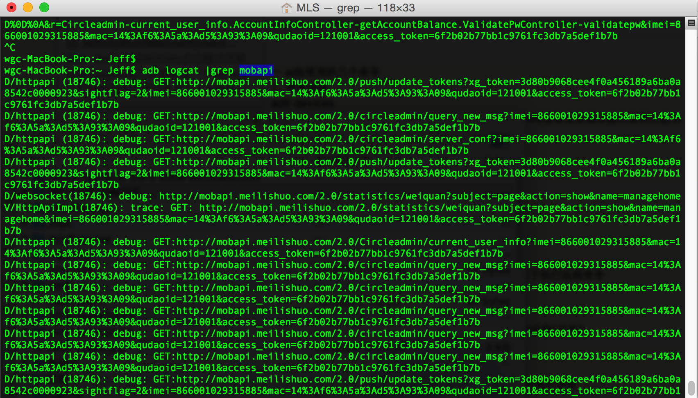
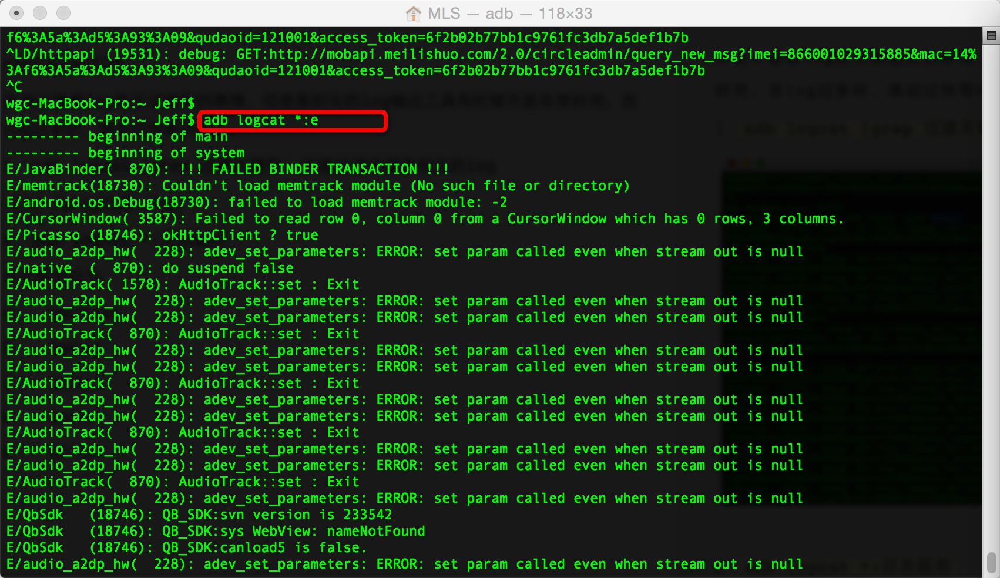

### 一、logcat过滤
开发中查看log是无法避免的事情，但是图形化的log输出工具有时候不是非常好用，当log过多时，滚动过快等问题。
1 `adb logcat |grep 过滤关键字` 快速过滤关键字相关的log

2 `adb logcat *:日志级别` 
日志级别:见 `三、Android Log简介`

### 二、常用的adb命令
1. `adb devices 查看设备` 这个命令是查看当前连接的设备, 连接到计算机的android设备或者模拟器将会列出显示.

2. 安装软件 卸载软件 
`adb install <apk文件路径>`
`adb uninstall <软件名>`

4. 登录设备shell
`adb shell`
`adb shell <command命令>`
这个命令将登录设备的shell.
后面加<command命令>将是直接运行设备命令, 相当于执行远程命令

5. 从电脑上发送文件到设备
`adb push <本地路径> <远程路径>`
用push命令可以把本机电脑上的文件或者文件夹复制到设备(手机)

6. 从设备上下载文件到电脑
`adb pull <远程路径> <本地路径>`
用pull命令可以把设备(手机)上的文件或者文件夹复制到本机电脑

7. 取得设备root权限
`adb remount`
三、Android Log简介
android.util.Log常用的方法有以下5个：Log.v() Log.d() Log.i() Log.w() 以及 Log.e() 。根据首字母对应VERBOSE，DEBUG,INFO, WARN，ERROR。

1、Log.v 的调试颜色为黑色的，任何消息都会输出，这里的v代表verbose啰嗦的意思，平时使用就是Log.v("","");

2、Log.d的输出颜色是蓝色的，仅输出debug调试的意思，但他会输出上层的信息，过滤起来可以通过DDMS的Logcat标签来选择.

3、Log.i的输出为绿色，一般提示性的消息information，它不会输出Log.v和Log.d的信息，但会显示i、w和e的信息

4、Log.w的意思为橙色，可以看作为warning警告，一般需要我们注意优化Android代码，同时选择它后还会输出Log.e的信息。

​5、Log.e为红色，可以想到error错误，这里仅显示红色的错误信息，这些错误就需要我们认真的分析，查看栈的信息了。

