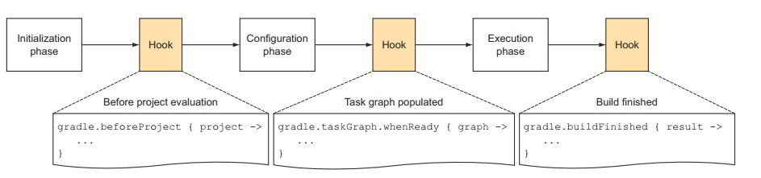

### Groovy
Groovy是一门JVM语言，也就是说Groovy的代码最终也会编译成JVM字节码， 交给虚拟机去执行。gradle之所以选择groovy语言，很重要的一个因素是groovy的结构看起来非常通俗移动，如同配置文件一般。
Groovy语法的简介:
#### 变量
groovy中没有固定的类型，有点类似于若类型的语言，变量可以通过def关键字引用
```
def name = 'Glan'
def hello = "Hello, $name"
```
`注意:` 单引号表示这个字符串只是单纯的字符串；而双引号则可以在字符中引用变量,进行插值操作。
#### 方法
groovy的方法也是通过def关键字进行定义的。方法如果不指定返回值，默认返回最后一行代码的值。
```
def square(def num){
    num*num
}
square 4
```
#### 类
```
class MyGroovyClass {
    String greeting //变量
    //方法
}
```
- Groovy中，默认所有的类和方法都是public的，所有的类的字段都是private的；
- new关键字穿件实例，使用def接受对象引用: def instance = new MyGroovyClass()
- 类中声明的字段，默认都会生成对应的setter和getter方法(有点类似于Object C)。所以代码中可以直接使用get和set方法。 `instance.setGreeting 'hello, groovy'`。
`注意`:groovy的方法调用是可以没有括号的，而且也不需要分号结尾(使用分号也不会报错)。 也可以直接通过instance.greeting这样的方式获取字段，其实调用的还是get方法。
#### Map、 Collections
创建list 
```
List list = [1, 2, 3, 4, 5]
```
遍历列表
```
list.each(){ element -> 
    println element
}
```
定义一个Map, map的key必须为字符，不写单双引号默认也是字符串
```
Map map = ['glan' : g,  'wang':2]
```
获取map的值
```
map.get('glan')
map['glan']
```
定义Range类:Range为List的一个拓展，
```
def aRange = 1..5  <==Range类型的变量 由begin值+两个点+end值表示
                      左边这个aRange包含1,2,3,4,5这5个值

如果不想包含最后一个元素，则

def aRangeWithoutEnd = 1..<5  <==包含1,2,3,4这4个元素
println aRange.from
println aRange.to
```
#### 闭包
闭包(Closure)， 是一种数据类型，它代表了一段可执行的代码，是Grooovy中一个非常重要的数据类型或者说一种概念。外型如下:
```
def aClosure = {//闭包是一段代码，所以需要用花括号括起来
    param1, param2 ->   //箭头前边标识参数，后面是代码
    println "this is code"   //这是代码，最后一句是返回值
    //也可以使用return进行返回，类似于Groovy函数
}
//总结:
def xxx = {paramters -> code}  //或者  
def xxx = {无参数，纯code}  这种case不需要->符号
```
调用闭包: 闭包对象.call(参数)  或者更像函数的调用方法 : 闭包对象(参数)
例如:
```
aClosure.call("hello", 100)   或者
aClosure("hello", 100)
```
`注意:`如果闭包没定义参数的话，则隐含有一个参数，这个参数名字叫it，和this的作用类似。it代表闭包的参数。
例如:
```
def greeting = {"hello, $it"}
//等同与
def greeting = { it ->  "hello, $it"}

def noParamClosure = { -> true} //标识没有参数的闭包，此时调用就不能传递参数否则报错
```
```
def square  = {num ->
    num * num 
   }
   square 8
```
如果只有一个参数，我们甚至可以省略这个参数，默认使用it作为参数，最后代码是这样的：
```
Closure square = {
    it * it
}
square 16
```
####Groovy I/O操作
- 读文件
```
def targetFile = new File(文件名)  //创建file对象
//1. 每一行兑取
targetFile.eachLine { line -> 
        println line
}
//2. 直接得到文件内容
targetFile.getBytes()  //或者直接targetFile.bytes
//3. 操作流
def  ism = targetFile.newInputStream()
//操作ism后需要关闭
ism.close
//4. 使用闭包操作inputStream，这种方式再gradle中常用.而且不需要自己关闭流
targetFile.withInputStrem { ism ->
    操作ism， 不用调用close， Groovy在闭包中会自动关闭
}
```
- 写文件: 和对文件基本差不多。
```
def srcFile = new File(源文件名)  
def targetFile = new File(目标文件名)  
targetFile.withOutputStream{ os->  
  srcFile.withInputStream{ ins->  
      os << ins   //利用OutputStream的<<操作符重载，完成从inputstream到OutputStream  的输出
   }  
} 
```
 
### Groovy in Gradle
了解了groovy的基本语法，我们来看看gradle的代码
- apply 
```
apply plugin: 'com.android.application'
```
这段代码其实就是掉用了project对象的apply方法， 传入的是一个以plugin为key的map对象。完整的写法为
```
project.apply([plugin: 'com.android.application'])
```
- dependencies
```
dependencies {
    compile 'com.google.code.gson:gson:2.2'
}
```
时机调用的时候会传入一个DependencyHandler的闭包，完整如下:
```
project.dependencies({
    add('compile' , 'com.google.code.gson:gson:2.2' , {
        //configuration statements
        })   
     })
```
#### Task 
- 创建Task
```
task hello {
    println 'hello, world'
}
```
gradle的声明周期有三步， 初始化， 配置和执行。上面的代码在配置过程中就已经支行了，所以打印出的字符串发生在任务执行之前，如果要再执行的阶段执行任务代码则需要如下:
```
task hello << {
    println ‘Hello, world’
}
```
- 添加Action :  
    Task包含一系列的action， 当task执行的时候，所有的action都会一次执行。如果我们想加入自己的action， 我们可以通过复写doFirst()和doLast()方法:
```
task hello {
    println 'Configuration'  //执行阶段之前
    doLast {
        println 'Bye bye'
    }
    doFirst {
        println 'Hello '
    }
}
```
运行gradle hello执行结果为
```
Configuration
:hello
Hello
Bye bye
```
- Task依赖: task的依赖关系有两种， mustRunAfter和dependsOn。
```
task task1 << {
    println 'task1'
}
task task2 <<{
    println 'task2'
}
task2.mustRunAfter task1  //第一种关系
task2.dependsOn task1  //第二种
```
他们的区别是，运行的的时候前者必须要都按顺序加入gradlew task2 task1执行才可以顺利执行，否则单独执行每个任务，后者只需要执行gradlew task2即可同时执行两个任务。
#### Gradle 的编译周期


编译过程分为三个阶段：

- 首先是初始化阶段。对我们前面的multi-project build而言，就是执行settings.gradle
- Initiliazation phase的下一个阶段是Configration阶段。
- Configration阶段的目标是解析每个project中的build.gradle。比如multi-project build例子中，解析每个子目录中的build.gradle。在这两个阶段之间，我们可以加一些定制化的Hook。这当然是通过API来添加的。
-Configuration阶段完了后，整个build的project以及内部的Task关系就确定了。恩？前面说过，一个Project包含很多Task，每个Task之间有依赖关系。Configuration会建立一个有向图来描述Task之间的依赖关系。所以，我们可以添加一个HOOK，即当Task关系图建立好后，执行一些操作。
- 最后一个阶段就是执行任务了。当然，任务执行完后，我们还可以加Hook。

在解析 Gradle 的编译过程之前我们需要理解在 Gradle 中非常重要的两个对象。Project和Task。

每个项目的编译至少有一个 Project,一个 build.gradle就代表一个project,每个project里面包含了多个task,task 里面又包含很多action，action是一个代码块，里面包含了需要被执行的代码。

在编译过程中， Gradle 会根据 build 相关文件，聚合所有的project和task，执行task 中的 action。因为 build.gradle文件中的task非常多，先执行哪个后执行那个需要一种逻辑来保证。这种逻辑就是依赖逻辑，几乎所有的Task 都需要依赖其他 task 来执行，没有被依赖的task 会首先被执行。所以到最后所有的 Task 会构成一个 有向无环图（DAG Directed Acyclic Graph）的数据结构。


