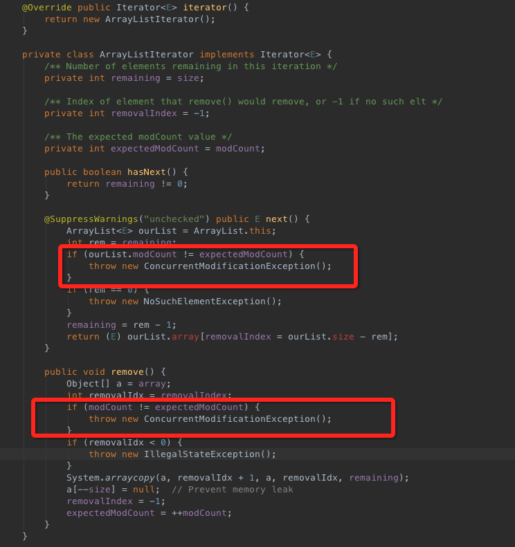
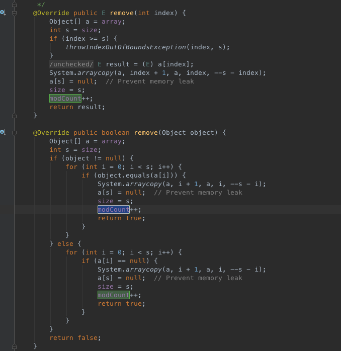

java.util.ConcurrentModificationException 这个异常是JAVA开发者刚刚接触java时经常产生的。但是什么情况下会产生这种异常呢？为什么会产生这种异常呢，如何避免呢？
###产生原因
先来看看一下集中情况：
```
    public static void testArrary(){
        ArrayList<Integer> aList = new ArrayList<Integer>();
        for (int i = 0; i < 5; i++) {
            aList.add(i*i);
        }
        for (Integer a : aList) {
            if(a == 4){
                aList.add(100);//包异常
            }
        }
        Iterator<Integer> iterator = aList.iterator();
        while (iterator.hasNext()){
            Integer next = iterator.next();
            if(next == 4){
//                aList.remove(next);//报异常
                iterator.remove();//不报异常
            }
        }
        for (int i = 0; i < aList.size(); i++) {
            Integer integer = aList.get(i);
            if(integer == 4){
                aList.remove(integer);//不报异常
            }
        }
        System.out.println(aList.size());
    }
 ```
`foreach 循环的原理`:编译器编译的时候会将foreach 循环编译成Iteger 的形式进行遍历。
从上边的几个异常案例我们可以发现合适会发生呢？`当使用了iterator，并且再遍历的时候直接对集合进行了修改(包括添加和删除)`。我们去看看iterator的源码，这里已ArraryList的Iterator为例来看：


从源码中我们找到了包异常的位置。仔细观察会发现`modCount`这个变了其实就是记录了当前List被修改（添加或者删除元素）的次数，expectedModCount是生成Iterator的时候当前List被修改的次数。一旦调用Iterator之后又再次修改了modCount，这两个值就不相等了，这个时候就直接报这个异常了。
从List的增加和删除方法都会改变这个变量的值。



###转载内容
以下内容转载：
原因： jdk5.0以上的for-each也是利用内部的iterator来遍历集合的（跟以前的iterator一样）获得的Iterator是一个内部类产生的迭代器，这个迭代器在调用next方法时，会检查列表是否被修改过，如果被修改过，就会抛出ConcurrentModificationException异常。进一步说，当使用 fail-fast iterator 对 Collection 或 Map 进行迭代操作过程中尝试直接修改 Collection / Map 的内容时，即使是在单线程下运xi,java.util.ConcurrentModificationException 异常也将被抛出。Iterator 是工作在一个独立的线程中，并且拥有一个 mutex 锁。 Iterator 被创建之后会建立一个指向原来对象的单链索引表，当原来的对象数量发生变化时，这个索引表的内容不会同步改变，所以当索引指针往后移动的时候就找不到要迭代的对象，所以按照 fail-fast 原则 Iterator 会马上抛出 java.util.ConcurrentModificationException 异常。　　所以 Iterator 在工作的时候是不允许被迭代的对象被改变的。但你可以使用 Iterator 本身的方法 remove() 来删除对象，Iterator.remove() 方法会在删除当前迭代对象的同时维护索引的一致性。
有意思的是如果你的 Collection / Map 对象实际只有一个元素的时候， ConcurrentModificationException 异常并不会被抛出。这也就是为什么在 javadoc 里面指出： it would be wrong to write a program that depended on this exception for its correctness: ConcurrentModificationException should be used only to detect bugs.
解决方法：在Map或者Collection的时候，不要用它们的API直接修改集合的内容，如果要修改可以用Iterator的remove()方法
由于for-each的写法，使我们无法获得iterator对象，所以这种遍历方式不能进行删除操作。

###How
方法一： 直接使用fori循环
方法二： 使用Iterator，并且使用Iterator进行remove操作。
    ```
            Iterator<Integer> iterator = aList.iterator();
        while (iterator.hasNext()){
            Integer next = iterator.next();
            if(next == 4){
//                aList.remove(next);//报异常
                iterator.remove();//不报异常
            }
        }
    ```
    添加可以使用ListIterator.
###ListIterator与Iterator的主要区别：
1. ListIterator比Iterator的功能强大，但是使用范围没有Iterator广。
2. ListIterator只能用于List，而Iterator可以用于List也可以用于Map等。
3. ListIterator可以进行逆向获取等更多功能。   


