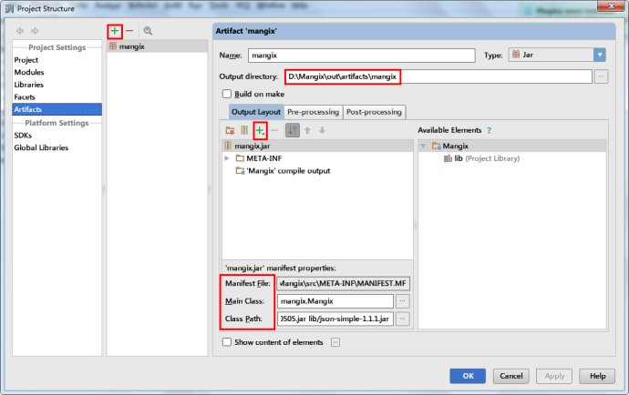

### 背景原因
Android Studio创建了Java的Module，想导出可执行jar包，但是直接执行了jar的Task发现其似乎没有让选择MainClass的选项。于是乎，用jar命令将编译生成的class文件进行打包生成jar，病指定了manifest文件。
可悲的是: 使用java -jar xxx.jar 运行此命令时，却发现直接诶报错。查了一下原因应该是环境变量设置的有问题。由于不太熟悉jar命令，所以直接放弃了这种方式。想用其他方式来生成可执行jar:
### 方式一: 
直接使用eclipse: 这确实是比较牛逼的方式，但是自从Android Studio之后从来没摸过eclipse了。总感觉eclipse太low逼了。
### 方式二:
想直接通过Android Studio导出可执行jar。无奈，Google将IDEA进行了阉割处理，好多IDEA有的功能都被替换了。
### 方式三:
使用IDEA导出可执行jar: Android Studio本身就是基于IDEA的，两者的使用方式都是相同的，但是android studio在idea的基础上做了android的定制。
打开File -> Project Structure -> Artifacts，如下图

注:此图为网络盗图
到此OK搞定，可直接执行java -jar xxx.jar进行验证jar是否有问题
