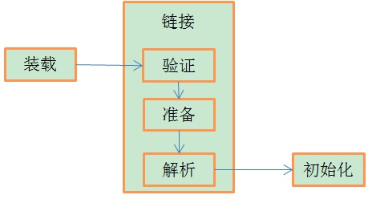
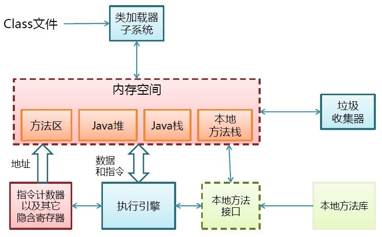
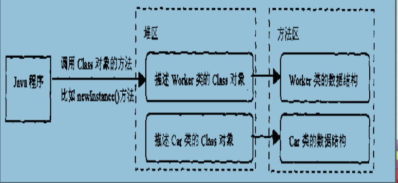
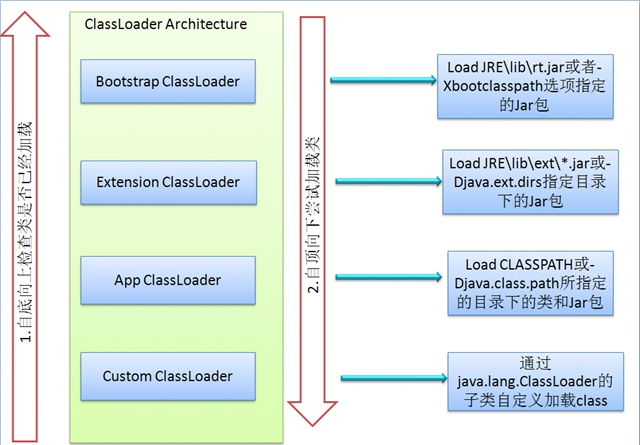

原文出处：[Java类加载器总结](http://blog.csdn.net/gjanyanlig/article/details/6818655)
相关资源：[http://www.blogjava.net/zhuxing/archive/2008/08/08/220841.html](http://www.blogjava.net/zhuxing/archive/2008/08/08/220841.html)
1.类的加载过程  
JVM将类加载过程分为三个步骤：装载（Load），链接（Link）和初始化(Initialize)链接又分为三个步骤，如下图所示：

1) 装载：查找并加载类的二进制数据；
2)链接：
验证：确保被加载类的正确性；
准备：为类的静态变量分配内存，并将其初始化为默认值；
解析：把类中的符号引用转换为直接引用；
3)初始化：为类的静态变量赋予正确的初始值；
          那为什么我要有验证这一步骤呢？首先如果由编译器生成的class文件，它肯定是符合JVM字节码格式的，但是万一有高手自己写一个class文件，让JVM加载并运行，用于恶意用途，就不妙了，因此这个class文件要先过验证这一关，不符合的话不会让它继续执行的，也是为了安全考虑吧。
        准备阶段和初始化阶段看似有点牟盾，其实是不牟盾的，如果类中有语句：private static int a = 10，它的执行过程是这样的，首先字节码文件被加载到内存后，先进行链接的验证这一步骤，验证通过后准备阶段，给a分配内存，因为变量a是static的，所以此时a等于int类型的默认初始值0，即a=0,然后到解析（后面在说），到初始化这一步骤时，才把a的真正的值10赋给a,此时a=10。

2. 类的初始化
    类什么时候才被初始化：
1）创建类的实例，也就是new一个对象
2）访问某个类或接口的静态变量，或者对该静态变量赋值
3）调用类的静态方法
4）反射（Class.forName("com.lyj.load")）
5）初始化一个类的子类（会首先初始化子类的父类）
6）JVM启动时标明的启动类，即文件名和类名相同的那个类
         只有这6中情况才会导致类的类的初始化。
     类的初始化步骤：
        1）如果这个类还没有被加载和链接，那先进行加载和链接
        2）假如这个类存在直接父类，并且这个类还没有被初始化（注意：在一个类加载器中，类只能初始化一次），那就初始化直接的父类（不适用于接口）
         3)加入类中存在初始化语句（如static变量和static块），那就依次执行这些初始化语句。

3.类的加载
       类的加载指的是将类的.class文件中的二进制数据读入到内存中，将其放在运行时数据区的方法区内，然后在堆区创建一个这个类的java.lang.Class对象，用来封装类在方法区类的对象。看下面2图

         类的加载的最终产品是位于堆区中的Class对象
        Class对象封装了类在方法区内的数据结构，并且向Java程序员提供了访问方法区内的数据结构的接口
加载类的方式有以下几种：
 1）从本地系统直接加载
2）通过网络下载.class文件
3）从zip，jar等归档文件中加载.class文件
4）从专有数据库中提取.class文件
5）将Java源文件动态编译为.class文件（服务器）

4.加载器
来自http://blog.csdn.net/cutesource/article/details/5904501
JVM的类加载是通过ClassLoader及其子类来完成的，类的层次关系和加载顺序可以由下图来描述：

1）Bootstrap ClassLoader
负责加载$JAVA_HOME中jre/lib/rt.jar里所有的class，由C++实现，不是ClassLoader子类
2）Extension ClassLoader
负责加载java平台中扩展功能的一些jar包，包括$JAVA_HOME中jre/lib/*.jar或-Djava.ext.dirs指定目录下的jar包
3）App ClassLoader
负责记载classpath中指定的jar包及目录中class
4）Custom ClassLoader
属于应用程序根据自身需要自定义的ClassLoader，如tomcat、jboss都会根据j2ee规范自行实现ClassLoader
加载过程中会先检查类是否被已加载，检查顺序是自底向上，从Custom ClassLoader到BootStrap ClassLoader逐层检查，只要某个classloader已加载就视为已加载此类，保证此类只所有ClassLoader加载一次。而加载的顺序是自顶向下，也就是由上层来逐层尝试加载此类。