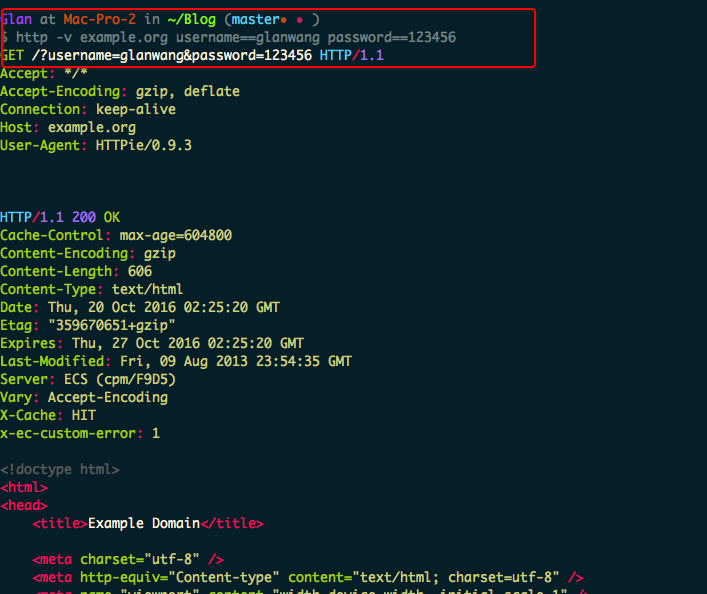
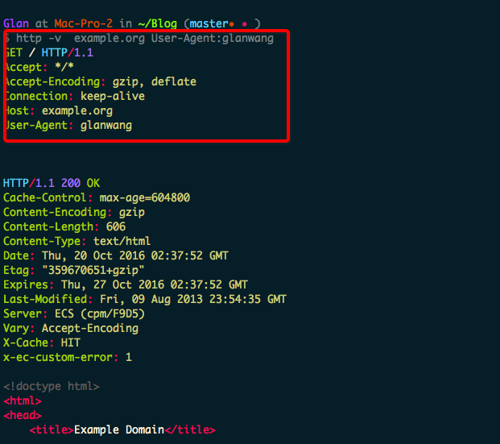
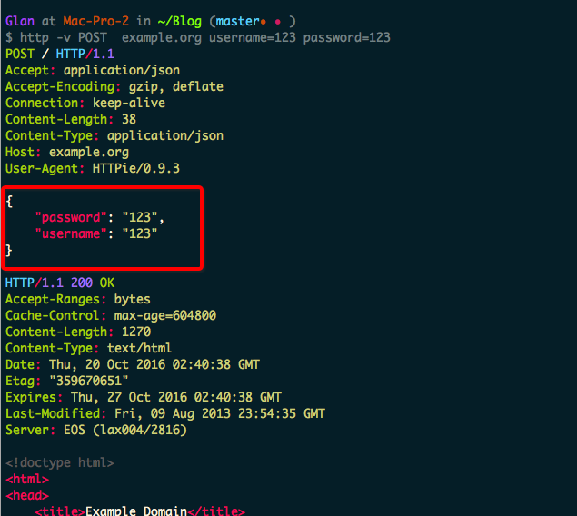
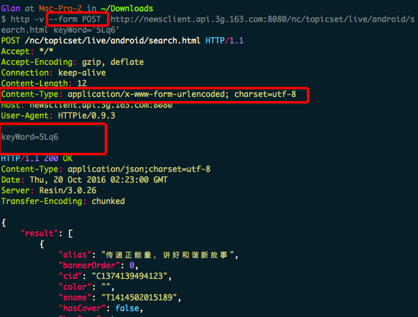

目前调试API接口的工具可以说多如红毛，chrome上的插件就又一大堆，使用哪个完全看个人的喜好。然而，如果你是一个命令控，那么恭喜你你可以继续向下看，如果你正在想成为一个命令控，你也可以下向下看。if you are UI Client user, you can go play!
### httpie的安装
这里只说一下Mac下的安装方式之一：直接使用brew命令来安装
`brew install httpie` 静等安装完成即可
### httpie简单使用
1. 最简单的get请求
    
2. 显示请求的详情加`-v`
3. GET请求并携带参数
    可以拼接到url后边，也可以让其自动拼接。 使用key==value时默认是GET请求，并把key=value拼接到url后边
    `http -v example.org username==glanwang password==123456`效果等同于参数自己拼装url后

4. 修改请求头（包括修改UA） `header:value`形式
    
5. 最简单的PUT/POST请求
    - 使用`PUT/POST`关键字
    
注意:后面添加`key=value`时默认是PUT请求（同时默认也是json提交）
6. 模拟POST提交表单使用`--form POST`或者`-f POST`
    
7. 模拟文件上传表单
    `http -f POST example.com/jobs name='John Smith' @/Users/Glan/Blog/source/_posts/Mac/Httpie使用/6.png`
    @后跟文件路径
    `http -f POST example.com/jobs name='John Smith' cv@~/Documents/cv.pdf  ` 
   ```
       <form enctype="multipart/form-data" method="post" action="http://        example.com/jobs">
    <input type="text" name="name" />
    <input type="file" name="cv" />
</form>
   ```
8. 模拟下载，类似于wget的功能
`http --download https://github.com/jkbrzt/httpie/archive/master.tar.gz`
下载此文件到当前目录
`http --download https://github.com/jkbrzt/httpie/archive/master.tar.gz --output Httpie使用/Download/httpmaster.tar.gz`
下载此文件到Httpie使用/Download目录并命名为httpmaster.tar.gz