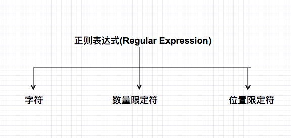
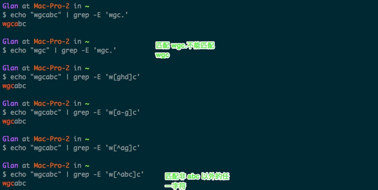
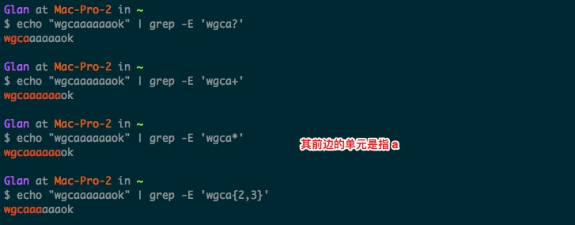
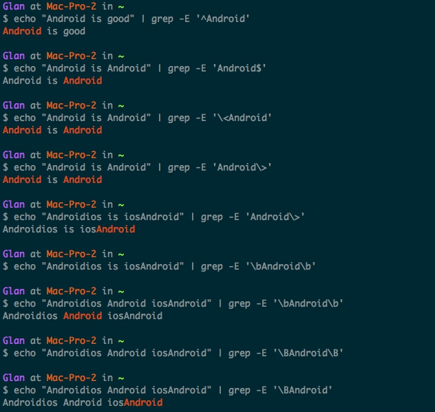

### 正则的意义 
正则对于平时的开发工作是非常有意义的，如果不用正则有可能你需要复杂的逻辑去完成一个需求。然而，使用正则的时候经常会`骂娘`， 为什么骂娘？ 无非两个原因: 一、看不懂了。二、忘记了规则实在写不出来。 其实，如果不是特别经常使用正则确实会忘的比较厉害。但是，如果你对正则进行一个深入的理解，是有助于长期记忆的。
### 正则表达式组成

如上图: 正则表达式有三部分组成: 字符、 数量限定符和位置限定符。掌握它的结构就非常容易看懂和写出正确的表达式。
#### 字符
| 字 符 | 含 义 | 栗 子 |
|:-----:|:------|:-----|
| .  |匹配任意字符|G.CD 可以配 GACD, GbCD, 但不匹配 GCD|
| [ ] |匹配括号中的任意一个字符|[abc]d 匹配 ad, bd, cd|
| - |在[]内部使用，表示范围|[0-9], [a-zA-Z]|
| ^ |括号内的开头，表示匹配除括号内的字符以外的任一字符； 不在括号内使用，标识匹配开头|[^wgc]匹配除 wgc 之外的任一字符|

#### 数量限定符
|数量限定符|含义|栗子|
|:-------------:|:--------|:------|
| ?  |匹配一次或者零次其前边的单元 | [0-9]\.[0-9]? 匹配小数点后可以有一个或0个0-9的数字|
| + | 匹配一次或多次其前边的单元 | wgc@[a-zA-Z]+匹配 wgc@之后有一个或多个字母|
| * | 匹配零次或多次其前边的单元 | [0-9]*  匹配至少一位数字 |
| {N} | 匹配 N 次其前边的单元| [1-9][0-9]{2} | 匹配100~999的三位数 |
| {N, } | 匹配至少 N 次其前边的单元 | |
| {, N} | 匹配最多 N 次其前边的单元 | |
| {N, M} |匹配最少 N 次，最多 M 次其前边的单元 | | 

#### 位置限定符
| 位置限定符 | 含义 | 栗子 |
|:-------------:|:------|:------|
| ^ | 匹配行守位置 | ^Android 匹配行首为 Android |
| $ | 匹配行尾位置 | Android$ 匹配已 Android 结尾 |
| \\< | 匹配`单个词`开头的位置 | \<wgc 匹配 wgcabcd 但是不匹配 wg cabcd |
| \\> | 匹配`单个词`结尾的位置 | wgc\> |
| \b | 匹配单个词开头或结尾的位置 | \bwgc\b 匹配 wgc 但不匹配 wgcisok |
| \B | 匹配非单词开头或者结尾的位置 | \Bwgc\B 匹配 abcwgcab  不匹配 wgcab | 

#### 特殊字符串
| 特殊字符 | 含义 |  栗子| 
|:----------:| :-------| :-----|
| \ |  转义字符  |  |
| () | 将正则表达式的一部分括起来组成一个单元，可以对整个单元使用数量限定符 | ([0-9]{1,3}\.){3}[0-9]{1,3}匹配 ip 地址 |
| 或 | 逻辑或 |  |
|s |空白字符：[ \t\n\x0B\f\r]  常用 |  |
| \t | 制表符 ('\u0009')  |  |
| \n |  新行（换行）符 ('\u000A')  | |
| \r | 回车符 ('\u000D')  |   |
|\f | 换页符 ('\u000C')  |   |
| \a |  报警 (bell) 符 ('\u0007')  |   |
| \e |  转义符 ('\u001B')  |   |
| \cx |  对应于 x 的控制符  |   |
