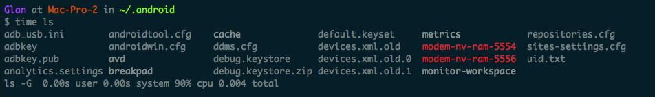

很多时候我们需要统计某个命令执行的时间或者统计某个脚本的执行时间，一般情况下我们有两种方案:a. 修改脚本在脚本执行开始和结束的时候使用date命令记录时间; b. 使用time命令记录脚本执行的时间。
### date命令的优缺点
date命令使用很方便，但是它有一个指名的缺点，date的时间戳是按照秒的级别计算的，而非毫秒级别计算。因此时间要求在毫秒级别的，使用date将会特别麻烦。
date命令使用详解: [http://www.cnblogs.com/barrychiao/archive/2012/10/08/2715808.html](http://www.cnblogs.com/barrychiao/archive/2012/10/08/2715808.html)
### Time命令
含义: time — 执行命令并计时
命令行执行结束时在标准输出中打印执行该命令行的时间统计结果，其统计结果包含以下数据：
1)实际时间(real time): 从command命令行开始执行到运行终止的消逝时间；
2)用户CPU时间(user CPU time): 命令执行完成花费的用户CPU时间，即命令在用户态中执行时间总和；
3)系统CPU时间(system CPU time): 命令执行完成花费的系统CPU时间，即命令在核心态中执行时间总和。
其中，用户CPU时间和系统CPU时间之和为CPU时间，即命令占用CPU执行的时间总和。实际时间要大于CPU时间，因为Linux是多任务操作系统，往往在执行一条命令时，系统还要处理其它任务。
另一个需要注意的问题是即使每次执行相同命令，但所花费的时间也是不一样，其花费时间是与系统运行相关的。
