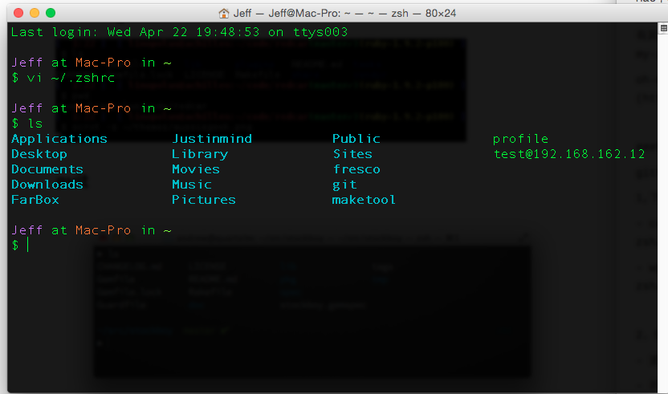

Mac下Shell默认的样式只有有限的几种，并且本人认为并不美观。于是想找一种替代的方案。本来自己下载了iTerm，很多人使用iTerm，但是我想修改器样式，修改后发现只有其背景可以改变，其他文字显示均没有发生变化。于是还是采用了第三方开源的oh-my-zsh。
oh-my-zsh的github地址：[https://github.com/robbyrussell/oh-my-zsh](https://github.com/robbyrussell/oh-my-zsh)

### 使用方式
github网站上已经介绍的非常详细，这里我就简单的写一下。
1,下载安装。
- curl安装方式：`curl -L https://raw.github.com/robbyrussell/oh-my-zsh/master/tools/install.sh | sh`
- wget安装方式：`wget https://raw.github.com/robbyrussell/oh-my-zsh/master/tools/install.sh -O - | sh`

2，修改主题。
- 通过`vi 使用oh-my-zsh修改Shell样式/.zshrc`命令编辑修改此文件中的主题。
- 找到ZSH_THEME="robbyrussell" 改变其默认的主题：本人使用的时`ZSH_THEME="steeef"`这个主题。

更多的主题信息可在[https://github.com/robbyrussell/oh-my-zsh/wiki/Themes](https://github.com/robbyrussell/oh-my-zsh/wiki/Themes)此处查看