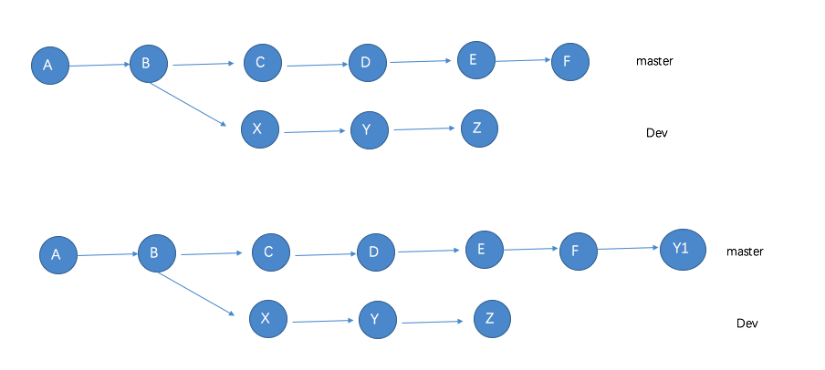

1. git移除某个指定的commit
    git revert命令，此命令用于引入一个新提交来抵消给定的提交的影响。
使用: git revert commitId
图解:
A ---B ---C ---D----E -----F
现在想要删除D这个commit，即删除D这个commit对当前分支的影响
使用git revert commit_D_id ,执行之后的状态
A---B---C---D----E----F----D1
D1的提交即是D的逆转。
上图解也说明了git revert的原理，git revert不修改版本库的历史纪录，相反它是王历史记录中添加新的提交。
2. git cherry-pick
